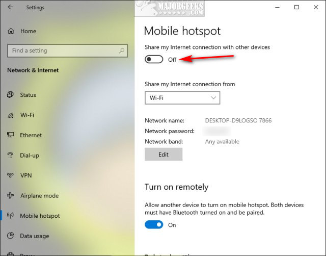

# Enabling Mobile Hotspot in Windows 10

In corporates, they often disable hotspot abilities, which can be inconvenient in the long run. However, the solution is quite easy. Here's what you need to do:

1. **For Windows 10 Users:**
   - Click Start > Settings > Network & internet.
   - Click on Mobile hotspot.
   - Toggle the mobile hotspot on or off at the top.

   

2. **If you're having problems:**
   - Open regedit and navigate to HKEY_LOCAL_MACHINE\SOFTWARE\Policies\Microsoft\Windows\Network Connections.
   - Create a New > DWORD (32-bit Value) and name it NC_ShowSharedAccessUI.
   - Double-click NC_ShowSharedAccessUI and change the Value data to 1.
   - To turn off the mobile hotspot, either delete the key or change the Value data to 0.

[Information Source](https://www.majorgeeks.com/content/page/enable_or_disable_mobile_hotspot_in_windows_10.html).
